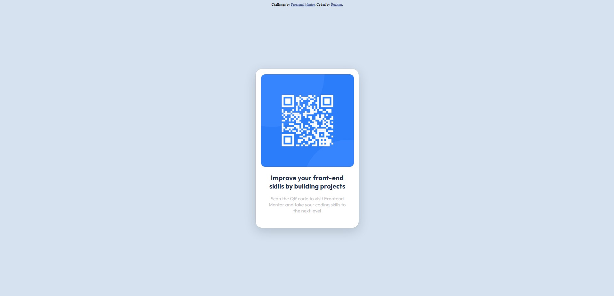

# Frontend Mentor - QR code component solution

This is a solution to the [QR code component challenge on Frontend Mentor](https://www.frontendmentor.io/challenges/qr-code-component-iux_sIO_H). Frontend Mentor challenges help you improve your coding skills by building realistic projects.

## Table of contents

- [Overview](#overview)
  - [Screenshot](#screenshot)
  - [Links](#links)
- [Author](#author)

## Overview

### Screenshot

### Links

- Solution URL: [https://github.com/ZenciJapon/QRCodeCompany/blob/main/index.html](https://github.com/ZenciJapon/QRCodeCompany/blob/main/index.html)
- Live Site URL: [https://zencijapon.github.io/QRCodeCompany/](https://zencijapon.github.io/QRCodeCompany/)

## Author

- Frontend Mentor - [@ZenciJapon](https://www.frontendmentor.io/profile/ZenciJapon)
- Twitter - [@idemirhann](https://www.twitter.com/idemirhann)
